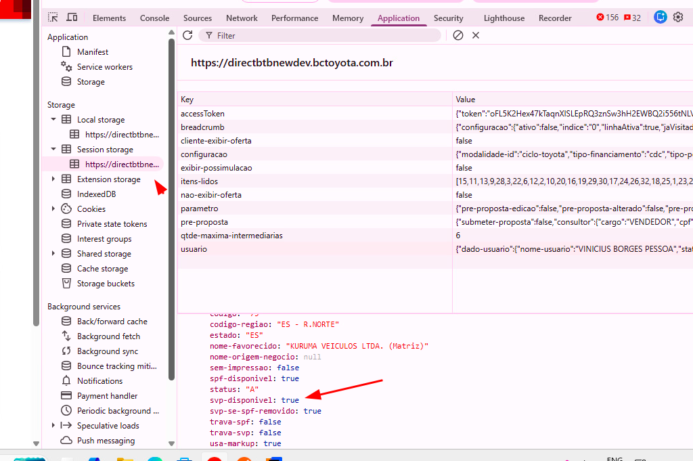

glossario
PF - cliente Pessoa Fisica
PJ - cliente Pessoa Juridica
SVP - Seguro de Vida Prestamista
SPF - Seguro de Protecao Financeira
SPF Plus - Seguro de Protecao Financeira Plus
-----------------------------------------------------------------------------------------------------------------------------------------------

1° verificar elegibilidade da loja para ofertar o SVP para o PJ.
como atualmente tudo ja existe para a pessoa fisica, é só manter

-----
anotacoes e observacoes sobre essa etapa passada no refinamento

para pessoa juridica, vamos ofertar seguro prestamista no direct

existem 3 tipos de seguro ofertados na toyota: SPF Plus(protecao financeira plus), SPF(protecao financeira) e SVP(seguro vida. em caso de morte) e no caso do PF todos são ofertados.
No caso de PJ só exite SVP (protecao vida em caso de morte)
entao, logo se uma loja só oferta SPF Plus e SPF, por dedução lógica não ofertara seguro prestamista de PJ ja que tambem nao oferta para PF.

uma coisa é a elegibibilidade do cliente pj.
outra coisa é a loja poder ofertar o SVP (seguro de vida prestamista)

uma duvida que o Eduardo ficou de me ajudar é se caso uma loja oferte o SPF Plus ela ja oferta todos os demais tbm. 
Ou seja, se existe alguma condicao onde uma protecao credencia outras de forma automatica
-----

historia do jira
História 1 – Verificar elegibilidade da loja PJ para ofertar SVP
Como sistema
Quero verificar se a loja é elegível para ofertar Seguro Prestamista para PJ.
Para garantir que a oferta de seguro só ocorra quando permitida

Regras de Negócio
É Necessário verificar se a loja logada SVP (SOMENTE PROTEÇÃO VIDA) - Analisar como é o retorno do endpoint (se retorna todos os tipos de seguro elegível ou somente o maior da hierarquia - e se atender ao maior, atende aos que estão “abaixo” (SPF PLUS, SPF e SVP) @Eduardo Souza  E @Carlos Pijanowski Cartaxo

A verificação é obrigatória antes de qualquer validação de cliente.

Se a loja não for elegível, o seguro:

Não deve ser ofertado;

Não deve chamar o endpoint de elegibilidade do cliente.

Manter no mesmo ponto a identificação da loja (ao escolher a loja) - verificar local de verificação para PF.

Critérios de Aceite
✅ Dado que o cliente é PJ
✅ Quando a loja não for elegível para SVP
➡️ Então o seguro não deve ser ofertado em nenhuma etapa da simulação

✅ Dado que o cliente é PJ
✅ Quando a loja for elegível para SVP
➡️ Então o fluxo deve seguir para verificação de elegibilidade do cliente

-----------------------------------------------------------------------------------------------------------------------------------------------
2° verificar elegibilidade do cliente PJ

-----
anotacoes e observacoes sobre essa etapa passada no refinamento

-----

historia do jira
História 2 – Verificar Elegibilidade Cliente

Key details
Description

Como sistema
Quero validar a elegibilidade do cliente PJ
Para decidir se o seguro pode ser cotado

Regras de Negócio
Valor financiado inicial = Valor do bem (valor do bem, itens financiados,  serviços, seguros, conforme lógica já existente) – Valor da entrada

Chamar endpoint de elegibilidade - Chamar endpoint /seguros/v2/prestamista/juridica/calculo para verificar elegibilidade para o cliente. 
(isso é novo, atualmente a regra está na SIMU, mas para PJ deverá ser chamado o endpoint de seguros)

Valor seguro retornado pelo endoint derá ser somado ao valor financiado
SIMU deve calcular juros sobre o valor total (Valor do bem + valor seguro)
Valor final da proposta = valor financiado + valor do seguro + juros
Verifica se cliente é elegível novamente, agora considerando o valor financiado total (chamar endpoint de elegibilidade novamente OU fazer cálculo na aplicação)
Cálculo: Valor comprometido do cliente + Valor da proposta <= Limite Máximo do Produto (somente contratos com o seguro prestamista deve ser considerado no valor comprometido do cliente)

Se for menor, ofertar produto
Se for maior que o limite maximo, não ofertar produto.
Seguro deve ser removido automaticamente
Recalcular simulação sem seguro

Em caso de erro técnico ou funcional:
Seguro não deve ser ofertado
Fluxo de simulação principal deve continuar
O cliente só verá o resultado final após confirmação completa da elegibilidade e valor comprometido.
OBS IMPORTANTE: Toda inclusão/remoção/alteração de qualquer produto e serviço, INCLUINDO  SERVIÇO GEOLOCALIZAÇÃO, valorres da simulação, demandará um recalculo, conforme já é atualmente.

-----------------------------------------------------------------------------------------------------------------------------------------------
-----------------------------------------------------------------------------------------------------------------------------------------------
-----------------------------------------------------------------------------------------------------------------------------------------------
-----------------------------------------------------------------------------------------------------------------------------------------------
-----------------------------------------------------------------------------------------------------------------------------------------------

quais os backends envolvidos no desenvolvimento para a entrega?
todas as questoes de seguros prestamistas é na aplicacao financiamento seg

-----------------------------------------------------------------------------------------------------------------------------------------------
qual a documentacao devera ser atualizada ou preenchida?

-----------------------------------------------------------------------------------------------------------------------------------------------
tarde... bom ae Edu?!
o Felipe disse que talvez o ponto de implementação seria no simulacaoservice. Faz sentido isso?
Pra ir descontinuando a Simu.

nao sei se você lembra, mas ele falou isso ontem.

Sim, porém a mudança é uma funcionalidade que faz a cotação, então teríamos levar toda essa funcionalidade para lá, 
faz sentido se já vamos subir esse em prod, levando essa funcionalidade como um todo.
 
-----------------------------------------------------------------------------------------------------------------------------------------------

Lacunas que precisamos fechar no refinamento
1.
Fonte da elegibilidade da loja PJ (História 1):
Vai vir do endpoint PJ novo, do endpoint PF migrado, ou de outra fonte?
No .md isso está em aberto (hierarquia SPF+/SPF/SVP).
Resposta: Vai vir do endpoint PJ novo, que tem a hierarquia de seguros. 
Se o cliente for elegível para o SVP, ele é elegível para os outros dois. 
Se for elegível para o SPF, é elegível para o SPF Plus. E se for elegível para o SPF Plus, é elegível somente para ele.

2.
Mapeamento de campos obrigatórios do endpoint PJ:
hoje não está claro no request da SIMU para: chave-origem, canal-origem, cnpj-cliente, flag-financia-iof, valor-iof-operacao.
Resposta: chave-origem e canal-origem são obrigatórios. cnpj-cliente é obrigatório para PJ e opcional para PF. 
flag-financia-iof e valor-iof-operacao são opcionais.

3.
Semântica de codigo-resposta do endpoint PJ:
quais códigos são “elegível”, “não elegível”, “erro funcional” e “erro técnico” na prática.
Resposta: a ideia é preservar ao maximo o comportamento atual do endpoint PF.

4.
Regra do segundo check de elegibilidade:
chamar endpoint PJ duas vezes (como texto sugere) ou fazer segundo cálculo local.
Resposta: chamar duas vezes, para preservar o comportamento atual do endpoint PF, que é a base para o PJ.

5.
Escopo exato neste repositório:
o PDF inclui folheteria e proposta; neste código não achei integração desses fluxos (parece outro backend).
Resposta: nao implementar isso no momento.

6.
Migração do endpoint PF no mesmo pacote?
PDF pede migração PF para /seguros/v2/..., mas o código atual usa seguro.prestamista.plus.url com modelo atual. Precisamos confirmar se entra agora.
Resposta: a ideia é preservar ao maximo o comportamento atual do endpoint PF. A atividade atual é implementar PJ.

7.
Comportamento funcional para PJ na API atual:
hoje o sistema força “PJ sem prestamista” em vários pontos; isso terá impacto de contrato de response/validação.
Resposta: a oferta de seguro para PJ prestamista é algo novo. Atualmente existe para PF. Para PJ é algo novo.

---------------------------------------------

Pontos que ainda precisam fechar:
1.
Contradição funcional
Você disse que PJ é novo e, historicamente, “só SVP”, mas também trouxe hierarquia SPF/SPF Plus/SVP para PJ.
Preciso confirmar: para cliente PJ, a SIMU deve ofertar apenas SVP ou pode ofertar SPF/SPF Plus também?
Resposta: a oferta de seguro para PJ deve ser apenas SVP (seguro de vida prestamista). SPF/SPF Plus não é compatível com PJ.

2.
Elegibilidade da loja “antes da cliente”
O endpoint PJ exige cnpj-cliente obrigatório. Como fazer a validação da loja antes da de cliente nesse caso?
Precisamos definir se:
◦ a mesma chamada já vale como loja+cliente, ou
◦ existe outra chamada de loja.
Resposta: como precisamos nos preocupar com a elegibilidade da loja apenas no contexto do backend, precisamos
ter um endpoint de elegibilidade da loja no caso de PJ.

3.
Mapa de codigo-resposta para decisão de fluxo
“Preservar PF” está correto como direção, mas preciso da matriz objetiva:
◦ quais códigos = elegível
◦ quais = não elegível (remove seguro e segue)
◦ quais = erro funcional/técnico (fallback sem seguro)
Resposta: atualmente o fluxo para pf já funciona. e PJ nao tem a oferta de seguro de vida prestamista. precisamos ter
um endpoint de elegibilidade da loja no caso de PJ.

4.
Fonte de canal-origem e chave-origem
De onde vêm exatamente no backend SIMU (header, request, config fixa, origem-solicitação)?
Resposta: verifique e tente deixar da mesma forma que PF.

5.
Fonte de cnpj-cliente na SIMU
Hoje os requests principais usam mais cpf-proponente/tipo-pessoa.
Para PJ, qual campo oficial da API de entrada será usado para enviar cnpj-cliente?
Resposta: verifique e tente deixar da mesma forma que PF.

6.
2ª chamada: valor exato de valor-base-calculo
Confirmar fórmula final que vai na segunda chamada (valor financiado + seguro + juros? qual campo exato da SIMU).
Resposta: verifique e tente deixar da mesma forma que PF.

7.
Campos opcionais de IOF
flag-financia-iof e valor-iof-operacao são opcionais: enviamos null quando não houver ou sempre tentamos preencher?
Resposta: verifique e tente deixar da mesma forma que PF.

8.
Escopo de endpoints da SIMU
Confirmar onde PJ prestamista entra agora: só simulação principal (/parcelas/...) ou também oferta prestamista (/ofertas/prestamistas/...), simplificada, validação etc.
Resposta: verifique e tente deixar da mesma forma que PF.

-----------------------------
O que já está fechado:
PJ deve ofertar somente SVP.
PF deve permanecer como está.
Folheteria/proposta estão fora do escopo agora.
A ideia é fazer duas validações para PJ (mantendo lógica próxima do PF).

O que ainda falta fechar:
1.
Contradição no próprio arquivo: na parte antiga (linhas 123–125) ainda fala de hierarquia SPF/SPF+/SVP para PJ, 
mas depois (linha 165) diz só SVP. Precisamos cravar qual regra oficial vale (eu entendi que é só SVP).
Resposta: a oferta de seguro para PJ deve ser apenas SVP (seguro de vida prestamista). SPF/SPF Plus não é compatível com PJ.

2.
Endpoint de elegibilidade da loja PJ: você disse que “precisamos ter um endpoint”, mas faltam contrato e ownership:
◦ URL/método
◦ request/response
◦ códigos de retorno
◦ quem implementa (este serviço ou outro backend).
Resposta: ainda sem resposta

3.
Mapa objetivo de decisão por código (elegível / não elegível / erro funcional / erro técnico) ainda não foi definido.
Resposta: ainda sem resposta

4.
Itens “deixar como PF” (canal-origem, chave-origem, cnpj-cliente, valor-base-cálculo 2ª chamada, IOF, escopo dos endpoints) 
ainda estão abertos porque o PF atual não usa o mesmo endpoint/contrato do PJ; então não dá para inferir 1:1 sem regra explícita.
Resposta: ainda sem resposta

5.
Escopo técnico na SIMU: “mesma forma que PF” pode significar muitos fluxos (simulação residual, desejada, ofertas, validação, simplificada etc.). 
Precisa lista explícita dos endpoints que entram nesta entrega.
Resposta: ainda sem resposta
